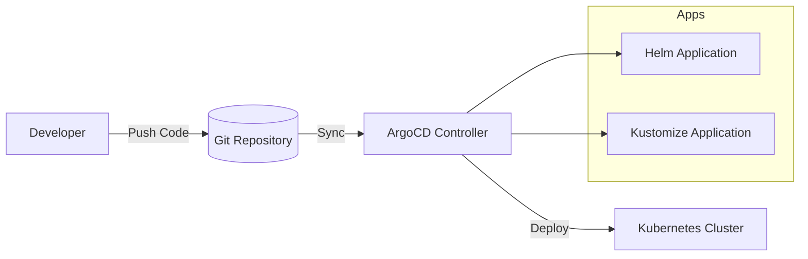

# 🚀 ArgoCD GitOps Projects

### Helm vs Kustomize Deployment Strategies on Kubernetes


---

## 📌 Overview

This repository demonstrates **real-world GitOps workflows using ArgoCD**, showcasing two industry-standard Kubernetes deployment strategies:

* 🚢 **Helm-based deployments**
* 🧩 **Kustomize-based deployments**

The goal is to provide a **comparative, hands-on implementation** of both approaches under a unified GitOps pipeline.

---

## 🎯 Objectives

* Implement GitOps using ArgoCD
* Compare **Helm vs Kustomize** in real deployments
* Structure Kubernetes manifests for scalability
* Demonstrate production-style repository organization

---

## 🏗️ Architecture



---

## 📁 Repository Structure

```bash id="pj3f7k"
ArgoCd-Projects/
│
├── helm-app/            # Helm-based deployment
│   └── README.md
│
├── kustomize-app/       # Kustomize-based deployment
│   └── README.md
│
└── README.md            # Main documentation
```

---

## ⚙️ Tech Stack

| Tool       | Purpose                            |
| ---------- | ---------------------------------- |
| Kubernetes | Container orchestration            |
| ArgoCD     | GitOps continuous delivery         |
| Helm       | Package manager for Kubernetes     |
| Kustomize  | Native configuration customization |

---

## 🚢 Helm vs 🧩 Kustomize

| Feature        | Helm         | Kustomize           |
| -------------- | ------------ | ------------------- |
| Approach       | Templating   | Overlay-based       |
| Complexity     | Medium–High  | Low–Medium          |
| Flexibility    | High         | Moderate            |
| Learning Curve | Steeper      | Easier              |
| Best For       | Complex apps | Environment configs |

---

## 🚀 Getting Started

### 1️⃣ Install ArgoCD

```bash id="kq9z2l"
kubectl create namespace argocd

kubectl apply -n argocd \
-f https://raw.githubusercontent.com/argoproj/argo-cd/stable/manifests/install.yaml
```

---

### 2️⃣ Access ArgoCD UI

```bash id="wq81dn"
kubectl port-forward svc/argocd-server -n argocd 8080:443
```

👉 Open: https://localhost:8080

---

### 3️⃣ Deploy Applications

#### Helm App

```bash id="qv2l0m"
argocd app create helm-app \
--repo https://github.com/saadhussain07/ArgoCd-Projects.git \
--path helm-app \
--dest-server https://kubernetes.default.svc \
--dest-namespace default
```

---

#### Kustomize App

```bash id="b72mxc"
argocd app create kustomize-app \
--repo https://github.com/saadhussain07/ArgoCd-Projects.git \
--path kustomize-app/overlays/prod \
--dest-server https://kubernetes.default.svc \
--dest-namespace prod
```

---

## 🔄 GitOps Workflow

1. Developer pushes changes to GitHub
2. ArgoCD detects repository updates
3. ArgoCD syncs desired state
4. Kubernetes cluster is automatically updated

---

## 🧠 Key Learnings

* Git as the **single source of truth**
* Declarative infrastructure management
* Automated deployment pipelines
* Real-world DevOps project structuring

---

## 📸 Suggested Improvements 

* Add ArgoCD UI screenshots
* Integrate CI pipeline (GitHub Actions)
* Add Helm values per environment
* Implement auto-sync policies

---

## 🤝 Contributing

Contributions are welcome. Feel free to fork the repo and submit pull requests.

---

## 📜 License

This project is open-source and available under the MIT License.

---

## 💡 Author Note

This project is built as a **hands-on GitOps lab** to demonstrate modern Kubernetes deployment strategies using ArgoCD.

---

⭐ If you find this useful, consider giving the repo a star!
